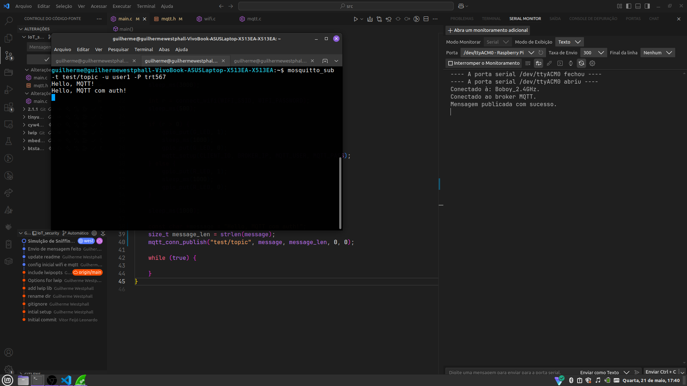
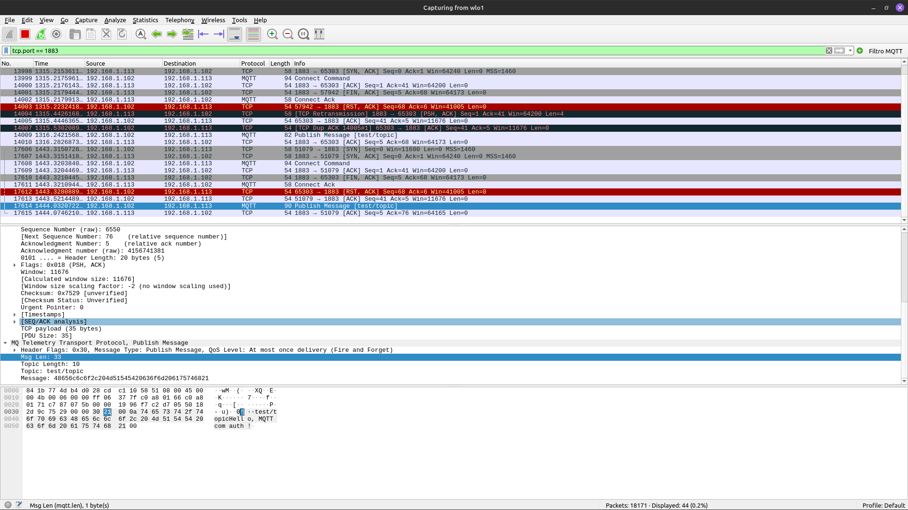
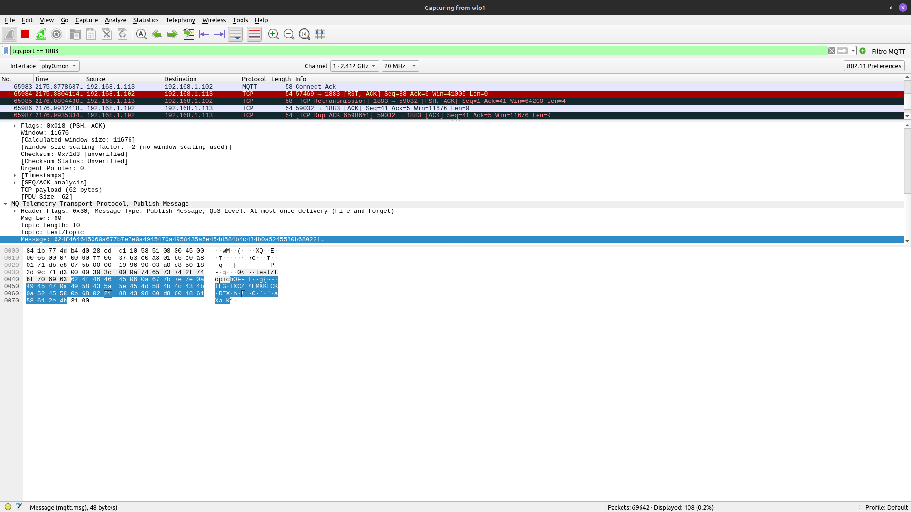

# Segurança em IoT

> Implementar mecanismos de segurança em uma comunicação IoT (MQTT), utilizando criptografia e autenticação.

## Objetivo 🎯

Configurar uma comunicação MQTT básica via Wi-Fi utilizando a BitDogLab com Raspberry Pi Pico W em C/C++ (SDK do Pico), aplicar autenticação no broker, implementar criptografia leve e proteger contra ataques de sniffing e replay.


## Componentes Utilizados 🛠️

| Componente          | Descrição                                    | Pinagem     |
| ------------------- | -------------------------------------------- | ----------- |
| Raspberry Pi Pico W | Placa de desenvolvimento com Wi-Fi integrado | -           |
| Broker MQTT         | Broker MQTT para comunicação (Mosquitto)     | -           |
| Botão A             | Usado para publicar em um tópico             | GPIO5       |
| Botão B             | Usado para se inscrever em um tópico         | GPIO6       |
| LED RGB             | Indicador de status da conexão               | GPIO11 e 13 |

## Relatório 📈

### Conexão Wi-Fi 

Inicialização da conexão de rede via Wi-Fi usando o SDK Pico W + lwIP. A conexão é estabelecida com o SSID e senha fornecidos, e o status da conexão é indicado pelo LED RGB (Verde para sucessor e Vermelho para falha). O código pode ser encontrado em [wifi.h](./inc/wifi.h) e [wifi.c](./hal/wifi.c).

### Setup MQTT 

Conectar as duas BitDogLab ao broker MQTT (Mosquitto), rodando localmente, utilizando o protocolo MQTT. O código de configuração do cliente MQTT está em [mqtt.h](./inc/mqtt.h) e [mqtt.c](./hal/mqtt.c). A configuração, inicialmente, é feita sem autenticação: 

> O arquivo de configuração padrão do mosquitto (/etc/mosquitto/mosquitto.conf) deve estar configurado:

```bash 
listener 1883
allow_anonymous true
```

### Publicação MQTT sem Segurança

Enviar mensagens, em texto claro (semm criptografia), para um tópico específico usando o botão A. Observar os pacotes usando o [Wireshark](https://www.wireshark.org/) e verificar a vulnerabilidade de **sniffing**. O código de publicação está em [mqtt.c](./hal/mqtt.c).


<center>

</center>

### Autenticação no Broker MQTT

Adicionar autenticação simples no broker e configurar no cliente para restringir o acesso apenas a dispositivos autenticados. Inclui configuração do arquivo de senhas e do broker.

> comando para criar o arquivo de senhas e adicionar um usuário (use a flag `-c` para criar o arquivo, ou seja, apenas na primeira vez  que usar o comando)

```bash
sudo mosquitto_passwd -c /etc/mosquitto/passwd nome_do_usuario
```
> Configure as permissões de leitura e escrita no arquivo de configuração do mosquitto `/etc/mosquitto/acl` e atualize o arquivo  `/etc/mosquitto/mosquitto.conf` para usar o arquivo de senhas e ACL

```bash
# acl
user #nome_do_usuario#
topic read/write #nome_do_topico#

# mosquitto.conf
allow_anonymous false
password_file /etc/mosquitto/passwd
acl_file /etc/mosquitto/acl
```

<center>


</center>

### Criptografia Leve

Implementar criptografia leve para proteger as mensagens enviadas via MQTT. Utilizar uma função básica de criptografia, como XOR. O código de criptografia está em [crypto.h](./inc/crypto.h) e [crypto.c](./hal/crypto.c).  

Posteriormente, a criptografia XOR foi substituída por uma criptografia mais robusta, a criptografia AES usando uma biblioteca leve, como [TinyAES](https://github.com/kokke/tiny-AES-c). A criptografia é aplicada antes da publicação e a descriptografia é feita ao receber as mensagens.

<center>

</center>

### Proteção contra Ataque Replay 

Implementar medidas para proteger contra ataques de **replay**, com a inclusão de timestamps. O timestamp é adicionado diretamente no payload da mensagem, na função de publicação [mqtt_conn_publish](./hal/mqtt.c). Ao receber uma mensagem, o cliente verifica se o timestamp é recente (dentro de um intervalo de tempo definido) para evitar a aceitação de mensagens antigas. 

## Execução 🧪

1. Faça o clone do projeto:

```bash
git clone https://github.com/west7/guilherme_westphall_embarcatech_HBr_2025.git
```

2. Compile e Embarque o firmware na Raspberry:

```bash
mkdir build
cd build
cmake ..
ninja
cp iot_security.uf2 /media/$USER/RPI-RP2/
```